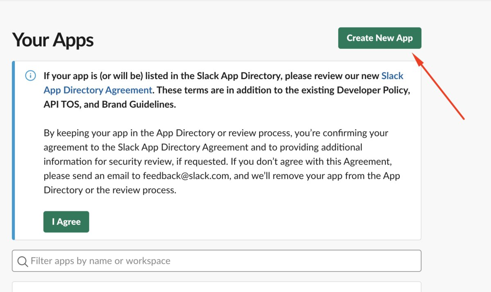
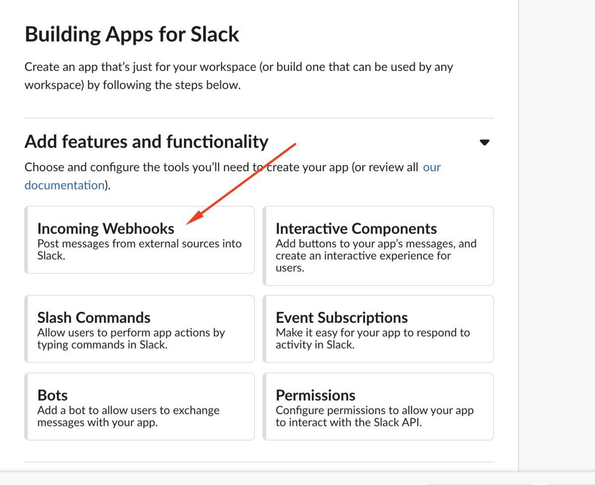
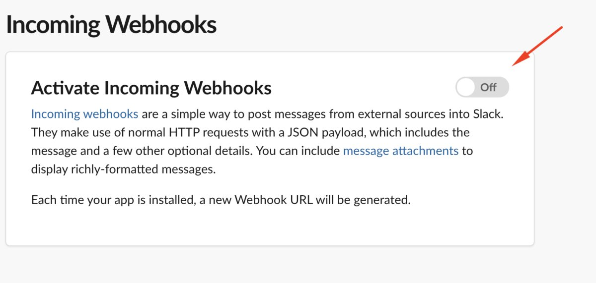

```{r, include = F}
knitr::opts_chunk$set(eval = F)
```


Notes on how to configure `slackr` to work in mac machines. Ripped from https://www.infoworld.com/article/3402657/how-to-slack-from-r.html since it's behind a subscription wall, so saving it here for others to use. 

Install `slackr` from CRAN

```{r}
install.packages("slackr")
```

Create a file `.slackr` in your base folder (~) which will contain the following:

```
api_token: <API TOKEN>
channel: #cornerr
username: slackr
incoming_webhook_url: <URL HOOK>
```

So you need an API token and a webhook URL. Go to https://api.slack.com/apps to Create New App. 



Then on Incoming Webhooks:



Activate the webhooks: 



And add a new webhook to the channel you want to (can be changed later). You can copy the webhook URL into the `.slackr` file above. 

The API token is a bit trickier, as it is a "legacy" token. You will get all sorts of warnings that this is deprecated but nevermind: go to https://api.slack.com/custom-integrations/legacy-tokens. You should find a list of all your workspace, select the one you want to connect to and generate an API token. Copy the API token into the `.slackr` file above. 

And then you're set. 

You can send messages to slack from R using: 

```{r}
slackr::slackr_msg()
```

