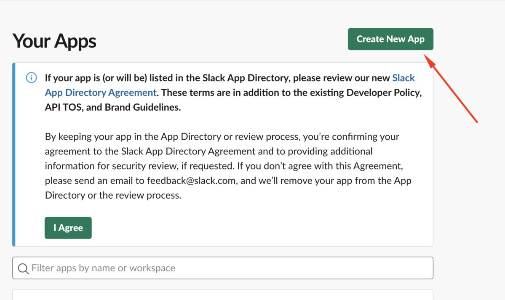
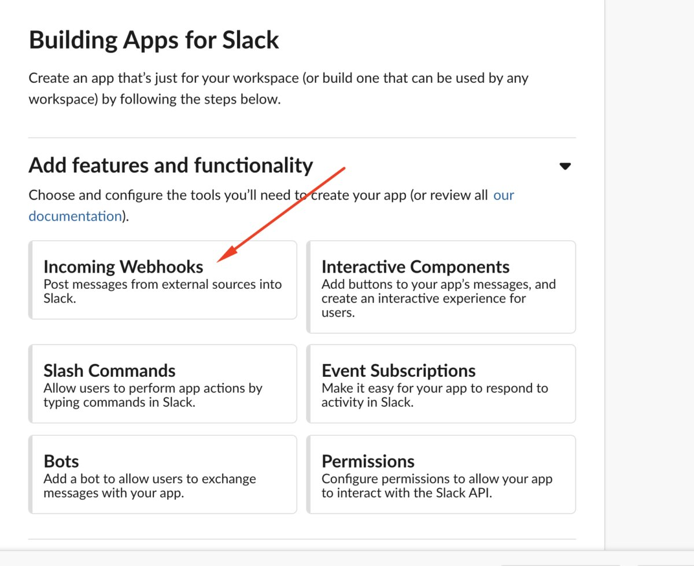
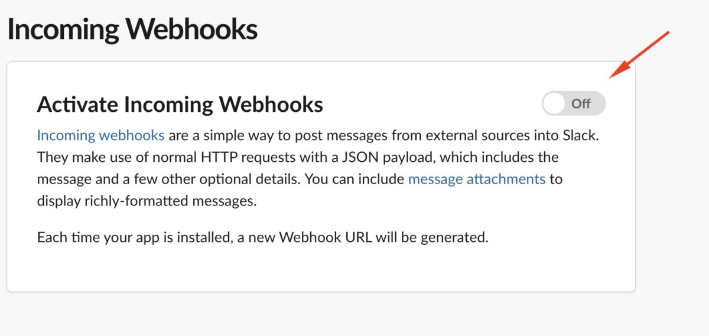

Slack Setup
================

Notes on how to configure `slackr` to work in mac machines. Ripped from
<https://www.infoworld.com/article/3402657/how-to-slack-from-r.html>
since it’s behind a subscription wall, so saving it here for others to
use.

Install `slackr` from CRAN

``` r
install.packages("slackr")
```

Create a file `.slackr` in your base folder (\~) which will contain the
following:

    api_token: <API TOKEN>
    channel: #cornerr
    username: slackr
    incoming_webhook_url: <URL HOOK>

So you need an API token and a webhook URL. Go to
<https://api.slack.com/apps> to Create New App.



Then on Incoming Webhooks:



Activate the webhooks:



And add a new webhook to the channel you want to (can be changed later).
You can copy the webhook URL into the `.slackr` file above.

The API token is a bit trickier, as it is a “legacy” token. You will get
all sorts of warnings that this is deprecated but nevermind: go to
<https://api.slack.com/custom-integrations/legacy-tokens>. You should
find a list of all your workspace, select the one you want to connect to
and generate an API token. Copy the API token into the `.slackr` file
above.

And then you’re set.

You can send messages to slack from R using:

``` r
slackr::slackr_msg()
```
